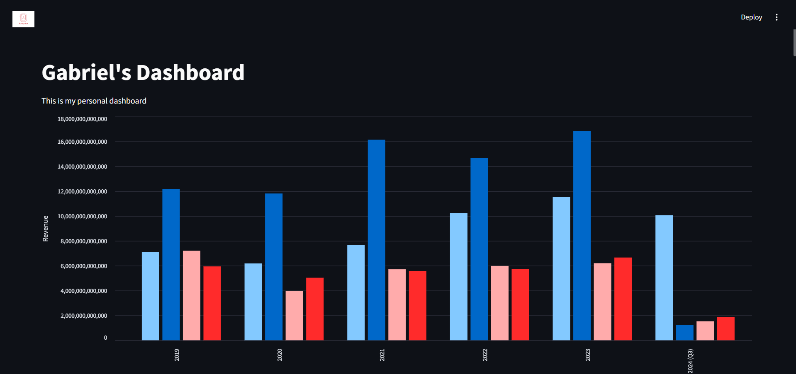
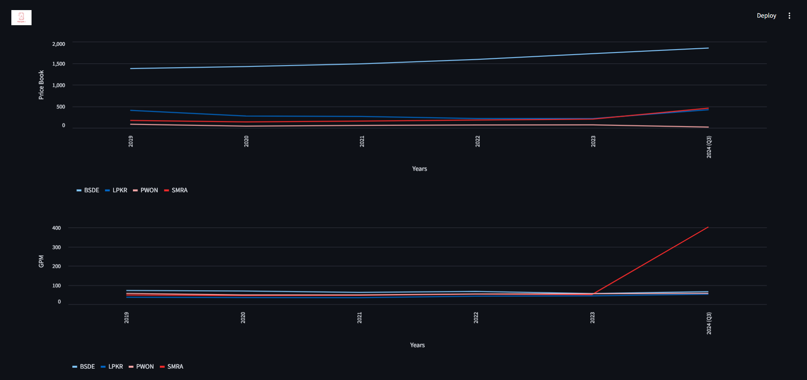
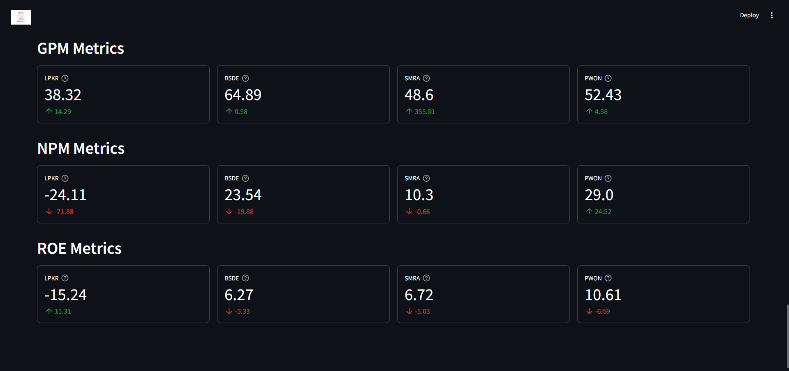

# Property Stocks Analysis
This project shows the results of analysis from real dataset of some stocks of property in Indonesia.
They are Lippor Karawaci (LPKE), Bumi Serpong Damai (BSDE), Pakuwon (PWON), and Summarecon Agung (SMRA).

## Results
Below are some pictures of the website that contains some fundamental of every stock.

Above picture shows the revenue of each stock by yearly, so we can make a decision which one has the greates revenue than others and how the growth of revenue from each stock. By analyzing this fundamental, we can be more confident when investing our money to that company.

Above picture shows the trend line of Price Book and Gross Profit Margin (GPM). Price Book is the instrinsic value of the stock, it represents the original price of stock regardless the buy/sell from people in in the market. Beside that, there's GPM that shows how good the sales from each stock, Gross Profit is the total revenue substracted by costs. Same as the price and revenue, these metrics are important to be looked.

Above picture shows the current metrics of each stock, such as Gross Profit Margin (GPM), Net Profit Margin (NPM), and Return of Equity (ROE). These are fundamental metrics and important to note.

## How to use
If you want to explore deeper of my project, you can clone this GitHub project or download it as ZIP file.
1. Extract ZIP directory
2. Open the directory using Visual Code or other IDE
3. Run/open new terminal
5. On terminal run "streamlit run app.py"

** Make sure open in the python's environment with "Streamlit" library installed!
